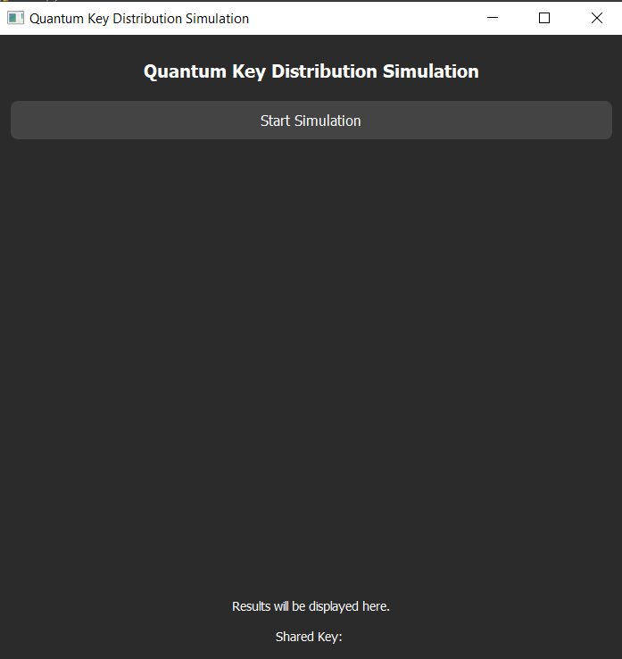

# Quantum-Key-Distribution-Simulation

## Project Description
This project simulates a Quantum Key Distribution (QKD) protocol using the BB84 protocol with a PyQt5 GUI. It uses the Qiskit library for quantum circuit simulation and visualizes the quantum circuit and results in an interactive GUI.

---

## Features
- Simulates QKD using the **BB84 protocol**.
- Visualizes the quantum circuit involved in the protocol.
- Displays Alice's qubits, Bob's bits, and the shared key.
- Interactive **PyQt5** GUI with a dark theme.
- Progress bar to indicate ongoing simulation.

---

## Requirements
To run this simulation, you need to have the following installed:
- **Python 3.7+**: Programming language used to implement the simulation.
- **PyQt5**: GUI of the project
- **Qiskit**: A Python framework for quantum computing to simulate quantum circuits.
- **qiskit_aer**: A high-performance simulator for running quantum circuits on classical computers.

You can install the required dependencies by running:
```bash
pip install PyQt5 qiskit qiskit-aer
```

---

## Usage
### Running the Simulation
1. Clone the repository:
```bash
git clone https://github.com/yourusername/Quantum-Key-Distribution-Simulation.git
cd Quantum-Key-Distribution-Simulation
```
2. Run the QKDApp.py script:
```bash
python QKDApp.py
```
3. The simulation window will appear with a "Start Simulation" button.
4. Click on the button to start the simulation. You will see:
- A progress bar indicating the simulation status.
- The quantum circuit diagram.
- Alice's qubits, Bob's bits, and the shared key once the simulation completes.

### Simulation Details
- **QKD Protocol**: The simulation uses the BB84 protocol, where Alice prepares quantum states (0 or 1) based on randomly chosen bases (0 or 1).
- **Quantum Circuit**: The quantum circuit consists of Hadamard gates applied to each qubit to create a superposition, followed by measurements to obtain the qubit values.
- Simulation Process:
  - Alice prepares qubits and sends them to Bob.
  - Bob measures the qubits using randomly chosen bases.
  - A shared key is generated if Alice and Bob use the same basis for measurement.

### Visualization
- The quantum circuit involved in the protocol is visualized using Qiskit's draw method, and the diagram is displayed in the GUI.
- The shared key and bit values are displayed once the simulation finishes.

## GUI Design
The app uses **PyQt5** for creating the GUI, which includes:
- A start button to initiate the simulation.
- A progress bar to indicate the ongoing simulation.
- Labels to display Alice's qubits, Bob's bits, and the shared key.

### Dark Theme Style
The GUI is designed with a dark theme for an elegant look and feel. Key elements like buttons, labels, and progress bars are styled with a minimalistic approach.

Example Screenshot



---

## Contributing
If you would like to contribute to this project, feel free to fork the repository and submit a pull request. Please make sure your code passes the test cases and follows the style guide used in the project.

### Steps for Contribution:
1. Fork the repository.
2. Create a new branch (git checkout -b feature-branch).
3. Make your changes and commit them (git commit -am 'Add new feature').
4. Push to your branch (git push origin feature-branch).
5. Create a pull request from your branch to the main repository.

---

## Acknowledgments
- **Qiskit** for the quantum computing framework.
- Inspiration from the **BB84** quantum cryptography protocol.
- Special thanks to the quantum cryptography community for their resources.

---

## Contact
For any questions or suggestions, feel free to open an issue in the GitHub repository or contact the project maintainer:
- **GitHub**: [heatblaze](https://github.com/heatblaze)
- **Email**: adityachitransh18@gmail.com

---
